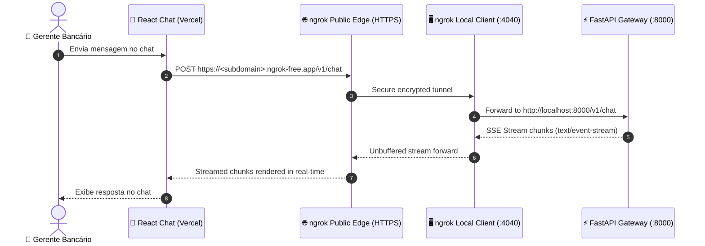

# Plan — S16 · ngrok Integration

## 1. Approach

Design and automate the ngrok tunneling bridge under `infra/ngrok/` and operational scripts under `scripts/`. This integration links the published React Chat frontend on Vercel with the local FastAPI Gateway. The solution focuses on automated tunnel provisioning, explicit CORS policies, SSE stream integrity, and clear runbooks.

## 2. Architecture & Components

```
atlas/
├── infra/
│   └── ngrok/
│       ├── ngrok.yml          # ngrok configuration (tunnels, inspect, auth)
│       └── README.md          # Setup instructions & token management
├── docs/
│   └── runbooks/
│       └── ngrok_tunnel.md    # Operational runbook for external lab demo
├── scripts/
│   ├── start_tunnel.py        # Automation: launches ngrok, extracts public URL via API
│   └── smoke_test_tunnel.py   # E2E smoke test verifying health, CORS, and streaming
└── src/
    └── api/
        └── middleware/
            └── cors.py        # CORS policy settings allowing Vercel origin
```

### Network & Data Path:



## 3. Configuration & Scripts

### `infra/ngrok/ngrok.yml`
```yaml
version: "2"
authtoken_from_env: true
tunnels:
  atlas-api:
    proto: http
    addr: 8000
    inspect: true
    bind_tls: true
```

### CORS Configuration in `src/api/middleware/cors.py`
```python
from fastapi import FastAPI
from fastapi.middleware.cors import CORSMiddleware


def setup_cors(app: FastAPI, allowed_origins: list[str]) -> None:
  app.add_middleware(
      CORSMiddleware,
      allow_origins=allowed_origins,  # e.g., ["https://atlas-chat.vercel.app", "http://localhost:5173"]
      allow_credentials=True,
      allow_methods=["GET", "POST", "OPTIONS"],
      allow_headers=[
          "Content-Type",
          "Authorization",
          "X-Session-ID",
          "ngrok-skip-browser-warning",
      ],
      expose_headers=["Content-Type"],
  )
```

## 4. Automation Script (`scripts/start_tunnel.py`)

1. Verify local FastAPI server is running on `http://localhost:8000/health`.
2. Start ngrok daemon pointing to port 8000.
3. Poll local API `http://127.0.0.1:4040/api/tunnels` until public URL is acquired.
4. Output public HTTPS endpoint:
   ```
   ==============================================================
   🚀 ATLAS ngrok tunnel active!
   🌐 Public HTTPS URL: https://abc1234.ngrok-free.app
   ⚙️ Set in Vercel / Frontend: VITE_API_BASE_URL=https://abc1234.ngrok-free.app
   📊 Traffic Inspector: http://localhost:4040
   ==============================================================
   ```

## 5. Test Strategy

- **Health & CORS Test:** Use `scripts/smoke_test_tunnel.py` with `httpx` to send `OPTIONS` and `GET /health` requests via the public ngrok URL, asserting `200 OK` and presence of `access-control-allow-origin`.
- **SSE Stream Verification:** Send `POST /v1/chat` request via the public tunnel and verify that response chunks arrive incrementally with content type `text/event-stream`.
- **Browser Warning Mitigation:** For ngrok free tier, include header `ngrok-skip-browser-warning: true` in the React frontend client to bypass the interim landing page.

## 6. Risks & Mitigations

- **Risk:** ngrok free tier URL changes on every restart, breaking the Vercel connection.
  - **Mitigation:** Use ngrok static domain if available on account, or use `scripts/start_tunnel.py` to quickly output the exact URL for updating Vercel project environment variables.
- **Risk:** Buffering of SSE stream by proxy intermediate layers.
  - **Mitigation:** Explicitly include `X-Accel-Buffering: no` header in FastAPI `StreamingResponse`.
