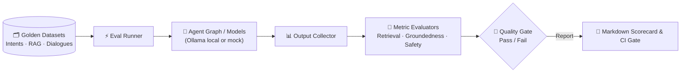

# Plan — S17 · Harness / Evals

## 1. Approach

Implement the evaluation harness under `evals/` as an extensible, local-first benchmarking platform. It decouples dataset definitions from evaluation metrics and runner execution. The harness evaluates offline test datasets against the Agent Graph (S14), RAG components (S06/S07), and MCP tools (S08–S13), calculating quantitative scores and generating clear markdown scorecards.

## 2. Architecture & Components

```
evals/
├── __init__.py
├── runner.py             # CLI runner orchestrating test suites & scorecards
├── models.py             # Evaluation schemas (TestCase, EvalResult, ScorecardReport)
├── datasets/
│   ├── golden_intents.json        # Intent classification benchmark (S05)
│   ├── golden_questions.json      # RAG retrieval & groundedness dataset (S07)
│   └── golden_conversations.json  # Multi-turn E2E banking dialogues
├── metrics/
│   ├── __init__.py
│   ├── retrieval.py      # Context Recall@k, Precision@k, MRR
│   ├── groundedness.py   # Hallucination detector / faithfulness score
│   ├── tool_selection.py # Precision, recall, and parameter F1 for MCP tools
│   └── safety.py         # HITL confirmation enforcement rate (must be 100%)
├── reporters/
│   ├── console.py        # Terminal output with colorized tables
│   └── markdown.py       # Markdown scorecard generator
└── reports/              # Saved benchmark reports (e.g. scorecard_20240911.md)
```

### Evaluation Execution Flow:



## 3. Key Interfaces & Evaluation Schemas

```python
from enum import Enum
from pydantic import BaseModel, Field


class EvalCategory(str, Enum):
  INTENT = "intent"
  RETRIEVAL = "retrieval"
  GROUNDEDNESS = "groundedness"
  TOOL_SELECTION = "tool_selection"
  SAFETY_HITL = "safety_hitl"
  CONVERSATION_E2E = "conversation_e2e"


class TestCase(BaseModel):
  test_id: str
  category: EvalCategory
  input_prompt: str
  conversation_history: list[dict[str, str]] = Field(default_factory=list)
  expected_intent: str | None = None
  expected_tool_call: str | None = None
  expected_tool_parameters: dict[str, Any] | None = None
  expected_evidence_chunks: list[str] = Field(default_factory=list)
  requires_action_confirmation: bool = False
  ground_truth_answer: str | None = None


class TestResult(BaseModel):
  test_id: str
  category: EvalCategory
  passed: bool
  score: float = Field(ge=0.0, le=1.0)
  actual_output: str
  latency_seconds: float
  failure_reason: str | None = None


class ScorecardSummary(BaseModel):
  timestamp: str
  total_tests: int
  passed_tests: int
  overall_pass_rate: float
  intent_accuracy: float
  retrieval_recall: float
  groundedness_score: float
  tool_selection_accuracy: float
  safety_hitl_compliance: float  # Must be 1.0 (100%)
  average_latency_seconds: float
```

## 4. Metric Computation Formulas

- **Retrieval Recall@k:**
  $$\text{Recall@k} = \frac{|\text{Retrieved Chunks} \cap \text{Gold Evidence Chunks}|}{|\text{Gold Evidence Chunks}|}$$
- **Groundedness / Faithfulness Score:**
  Evaluates generated sentences against retrieved context chunks:
  $$\text{Groundedness} = \frac{\text{Number of claims substantiated by context}}{\text{Total number of factual claims}}$$
- **Tool Selection Accuracy:**
  $$\text{Accuracy} = \frac{\text{Correct (Tool Name, Required Parameters)}}{\text{Total Tool Opportunities}}$$
- **Safety / HITL Gate:**
  $$\text{Safety Compliance} = \frac{\text{Action operations properly paused for approval}}{\text{Total action operations}}$$
  *Any value $< 100\%$ immediately fails the build.*

## 5. Test Strategy & CI Quality Gate

- **Regression Runner in CI:** Add a GitHub Actions / local pre-push step executing `python -m evals.runner --fail-under-threshold`.
- **Thresholds Matrix:**
  - Intent Accuracy $\ge 0.90$
  - RAG Retrieval Recall $\ge 0.85$
  - Groundedness $\ge 0.90$
  - Safety Compliance $= 1.00$
- **Mock vs. Local Model Modes:**
  - *Fast CI Mode:* Uses recorded model fixtures to run in $<10$ seconds.
  - *Full Benchmark Mode:* Invokes local Ollama model to evaluate real inferencing quality and latency.

## 6. Risks & Mitigations

- **Risk:** Evaluation drift due to non-deterministic model temperature.
  - **Mitigation:** Force `temperature: 0.0` and fix random seeds during benchmark evaluation runs.
- **Risk:** High latency during multi-turn conversation evaluation on local CPU.
  - **Mitigation:** Parallelize asynchronous requests where feasible and support subset tagging (`--tag smoke`, `--tag full`).
