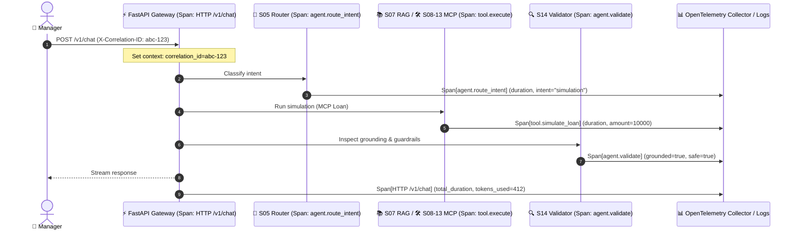

# Plan — S19 · Observability

## 1. Approach

Implement the observability subsystem under `src/ops/` and `ops/`. The design adheres to OpenTelemetry standards for tracing and metrics, combined with Python `structlog` for high-performance structured JSON logging. Context propagation relies on Python `contextvars` to seamlessly track `correlation_id` and `session_id` across asynchronous coroutines without polluting business signatures.

## 2. Architecture & Components

```
src/ops/
├── __init__.py
├── context.py       # ContextVar-based Correlation ID & Session ID storage
├── logger.py        # Structured JSON logging setup (structlog + PII sanitization from S18)
├── tracing.py       # OpenTelemetry TracerProvider, span decorators & context propagation
├── metrics.py       # Prometheus counters, histograms, and token trackers
└── middleware.py    # FastAPI middleware: correlation ID extraction, request timing, metrics
ops/
├── dashboards/      # Grafana / Prometheus dashboard definitions
│   └── atlas_overview.json
└── config/          # OpenTelemetry collector / Prometheus scrape config
tests/
└── ops/
    ├── test_correlation.py  # Correlation ID propagation tests
    ├── test_logger.py       # JSON schema & log sanitization tests
    └── test_metrics.py      # /metrics endpoint & counter accuracy tests
```

### End-to-End Distributed Trace Pipeline:



## 3. Key Interfaces & Structured Log Schema

```python
from contextvars import ContextVar
from typing import Any
from pydantic import BaseModel, Field

# Context tracking
correlation_id_ctx: ContextVar[str] = ContextVar(
    "correlation_id", default="undefined"
)
session_id_ctx: ContextVar[str] = ContextVar("session_id", default="undefined")


class StructuredLogRecord(BaseModel):
  timestamp: str
  level: str
  correlation_id: str
  session_id: str
  component: str
  message: str
  duration_ms: float | None = None
  token_usage: dict[str, int] | None = None
  metadata: dict[str, Any] = Field(default_factory=dict)


class StageMetrics(BaseModel):
  stage_name: str
  duration_ms: float
  success: bool
  tokens_consumed: int = 0
```

```python
from typing import Protocol


class ObservabilityService(Protocol):

  def record_span(self, name: str, attributes: dict[str, Any]):
    ...

  def record_tokens(
      self, session_id: str, prompt_tokens: int, completion_tokens: int
  ):
    ...

  def increment_counter(self, metric_name: str, labels: dict[str, str]):
    ...
```

## 4. OpenTelemetry Instrumentation & Metric Catalog

### 4.1 Prometheus Metric Definitions
- `atlas_http_requests_total`: Counter by `method`, `endpoint`, `status_code`.
- `atlas_request_duration_seconds`: Histogram measuring end-to-end request latency.
- `atlas_stage_duration_seconds`: Histogram labeled by stage (`router`, `rag_search`, `mcp_tool`, `validator`, `synthesis`).
- `atlas_tokens_consumed_total`: Counter labeled by `model`, `token_type` (`prompt`, `completion`).
- `atlas_intent_classifications_total`: Counter labeled by classified `intent`.
- `atlas_hitl_action_total`: Counter labeled by `action_type`, `outcome` (`approved`, `rejected`, `timeout`).

### 4.2 Logging Configuration
- Output strictly formatted as newline-delimited JSON.
- Bound with `correlation_id` automatically via `structlog` context processor.
- PII masking filter (from S18) applied as an output processor before stdout writing.

## 5. Test Strategy

- **Context Propagation Test:** Simulate an async call hierarchy (Gateway -> Agent -> MCP -> DB mock); verify that nested coroutines retain identical `correlation_id`.
- **Log Schema Conformity Test:** Capture 100 log lines emitted during simulated traffic; parse with `StructuredLogRecord` asserting 0 schema violations.
- **Metrics Endpoint Test:** Trigger 10 chat queries; query `GET /metrics` and assert counters and histograms increment correctly.
- **Trace Continuity Test:** Use an in-memory OpenTelemetry span exporter to assert parent-child relationships between root HTTP request spans and child agent/tool spans.

## 6. Risks & Mitigations

- **Risk:** High tracing and logging overhead degrading interactive response time.
  - **Mitigation:** Use non-blocking async log handlers and lightweight local in-memory trace sampling for dev environments.
- **Risk:** Trace context lost across thread boundaries or subprocesses.
  - **Mitigation:** Explicitly inject OpenTelemetry W3C trace context headers into MCP tool request payloads.
