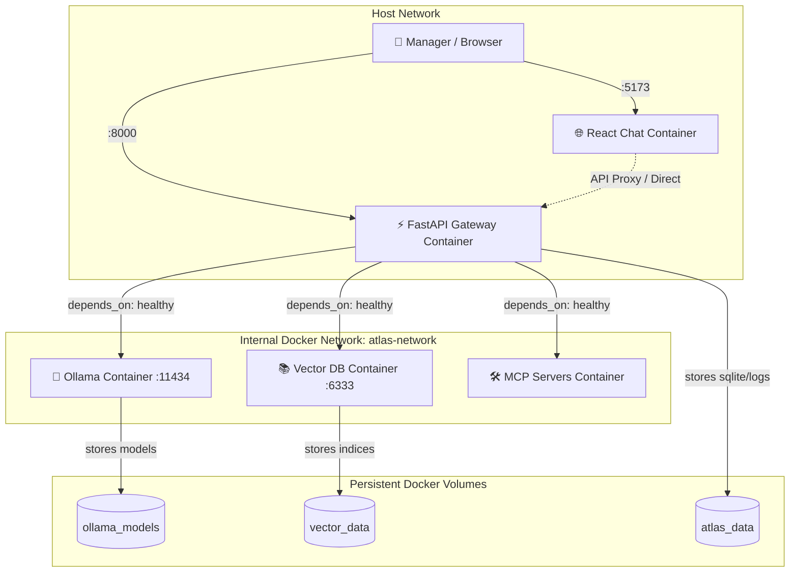

# Plan — S20 · Docker Local Stack

## 1. Approach

Design and implement the containerized environment under `infra/docker/`. The architecture uses a modular Docker Compose structure with named volumes, health checks, bridge networking, and multi-stage container builds. An initialization entrypoint ensures models are verified upon boot.

## 2. Architecture & Components

```
infra/docker/
├── docker-compose.yml       # Primary multi-service compose file
├── docker-compose.override.yml.example # Local developer overrides (GPU, debug ports)
├── Dockerfile.backend       # Multi-stage Python 3.11 container (FastAPI + Agent + MCP)
├── Dockerfile.frontend      # Multi-stage Node/Nginx container (React Chat)
├── init_ollama.sh           # Model pre-pulling script (llama3.2, nomic-embed-text)
└── .env.example             # Complete environment variable template
docs/
└── runbooks/
    └── docker_local_stack.md# Runbook: prerequisites, startup, troubleshooting, clean up
scripts/
└── smoke_test_docker.py     # Automated container health & integration smoke test
```

### Container Topology & Dependency Graph:



## 3. Docker Compose Specification (`infra/docker/docker-compose.yml`)

```yaml
version: "3.8"

networks:
  atlas-network:
    driver: bridge

volumes:
  ollama_models:
  vector_data:
  atlas_data:

services:
  ollama:
    image: ollama/ollama:latest
    container_name: atlas-ollama
    networks:
      - atlas-network
    volumes:
      - ollama_models:/root/.ollama
    ports:
      - "11434:11434"
    healthcheck:
      test: ["CMD-SHELL", "ollama list || exit 1"]
      interval: 10s
      timeout: 5s
      retries: 5
      start_period: 10s

  vector-db:
    image: qdrant/qdrant:latest
    container_name: atlas-vector-db
    networks:
      - atlas-network
    volumes:
      - vector_data:/qdrant/storage
    ports:
      - "6333:6333"
    healthcheck:
      test: ["CMD-SHELL", "timeout 2 bash -c '</dev/tcp/localhost/6333' || exit 1"]
      interval: 10s
      timeout: 5s
      retries: 3

  gateway:
    build:
      context: ../../
      dockerfile: infra/docker/Dockerfile.backend
    container_name: atlas-gateway
    networks:
      - atlas-network
    ports:
      - "8000:8000"
    environment:
      - OLLAMA_HOST=http://ollama:11434
      - VECTOR_DB_HOST=vector-db
      - VECTOR_DB_PORT=6333
      - LOG_LEVEL=INFO
      - ENVIRONMENT=local-docker
    volumes:
      - atlas_data:/app/data
    depends_on:
      ollama:
        condition: service_healthy
      vector-db:
        condition: service_healthy
    healthcheck:
      test: ["CMD", "curl", "-f", "http://localhost:8000/health"]
      interval: 10s
      timeout: 5s
      retries: 3

  frontend:
    profiles: ["frontend-local"]
    build:
      context: ../../3.frontend
      dockerfile: ../infra/docker/Dockerfile.frontend
    container_name: atlas-frontend
    networks:
      - atlas-network
    ports:
      - "5173:80"
    depends_on:
      gateway:
        condition: service_healthy
```

## 4. Multi-Stage Dockerfile Strategy (`Dockerfile.backend`)

1. **Builder Stage:**
   - Base: `python:3.11-slim`.
   - Install build tools (`gcc`, `curl`).
   - Install dependencies into a virtual environment (`/opt/venv`) using pinned dependencies or `uv`.
2. **Runtime Stage:**
   - Base: `python:3.11-slim`.
   - Copy virtual environment `/opt/venv` from builder.
   - Create non-root user `appuser:appgroup`.
   - Copy application code (`2.src/`).
   - Run as non-privileged user: `USER appuser`.
   - Expose port `8000` and start `uvicorn src.api.main:app --host 0.0.0.0 --port 8000`.

## 5. Test Strategy

- **Automated Smoke Test (`scripts/smoke_test_docker.py`):**
  - Check Docker daemon connection.
  - Run `docker compose ps` verifying all containers report `(healthy)`.
  - Send HTTP `GET http://localhost:8000/health` -> verify status ok.
  - Check Ollama API `http://localhost:11434/api/tags` -> verify models loaded.
  - Check Vector DB API `http://localhost:6333/healthz` -> verify HTTP 200.
  - Send sample simulation request to `/v1/chat` -> assert valid streamed response.
- **Persistence Verification Test:**
  - Ingest sample chunks into vector store.
  - Execute `docker compose restart vector-db`.
  - Assert chunk count remains unchanged.

## 6. Risks & Mitigations

- **Risk:** Slow initial startup due to heavy model downloads on first launch.
  - **Mitigation:** Document model pull requirements in `docs/runbooks/docker_local_stack.md` and use lightweight quantized models (`llama3.2:3b`) for the default profile.
- **Risk:** Port conflicts with existing local Ollama or Postgres instances on developer machines.
  - **Mitigation:** Use parameterizable port environment variables in `.env` (e.g., `GATEWAY_PORT=8000`, `OLLAMA_PORT=11434`).
