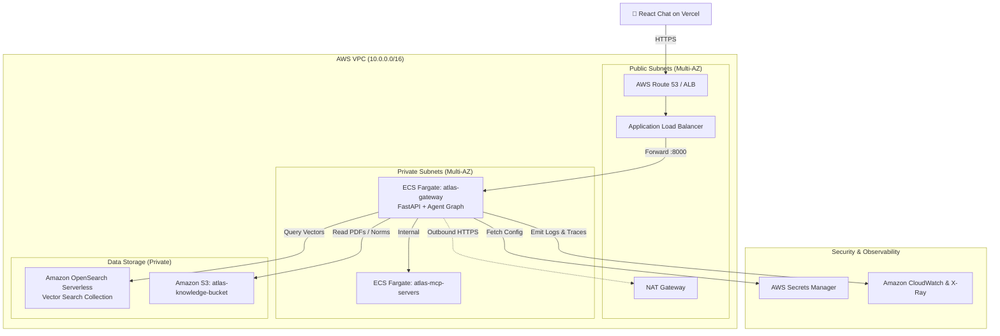

# Plan — S21 · Terraform AWS

## 1. Approach

Design and implement the modular Infrastructure as Code (IaC) configuration under `infra/terraform/`. The design uses modern Terraform (v1.5+), following HashiCorp best practices with reusable modules, remote state locking patterns (S3 + DynamoDB), strict variable type constraints, and static security linting.

## 2. Architecture & Components

```
infra/terraform/
├── MAPPING.md                 # Local-to-AWS architectural equivalence matrix
├── main.tf                    # Root composition wiring modules together
├── variables.tf               # Root input variables with validation rules
├── outputs.tf                 # Root outputs (ALB DNS, VPC ID, S3 bucket ARN)
├── terraform.tfvars.example   # Example variables file
├── environments/
│   ├── dev.tfvars             # Development environment parameters
│   └── staging.tfvars         # Staging environment parameters
└── modules/
    ├── network/               # VPC, Subnets (public/private), NAT Gateway, Route Tables
    ├── compute/               # ECS Cluster, Fargate Task Definition & Service, ALB & Target Groups
    ├── data/                  # S3 Knowledge Bucket, OpenSearch Serverless / Vector Store
    ├── security_iam/          # IAM Roles (TaskExecution, TaskRole), Secrets Manager, Security Groups
    └── observability/         # CloudWatch Log Group, Metric Alarms, X-Ray tracing
docs/
└── architecture/
    └── aws_cost_estimate.md   # Detailed monthly budget and cost model
```

### AWS Cloud Architecture Diagram:



## 3. Local-to-AWS Equivalence Matrix (`MAPPING.md`)

| Local Component (S00–S20) | AWS Cloud Equivalent (S21) | Technical Responsibility in Cloud |
| :--- | :--- | :--- |
| **FastAPI Gateway (Docker)** | **ECS Fargate + ALB** | Serves API, handles SSL/TLS termination, streams responses |
| **MCP Servers (Docker)** | **ECS Fargate (Sidecar or Service)** | Exposes typed domain tools inside private subnet |
| **Vector DB (Local Qdrant/Chroma)** | **OpenSearch Serverless Vector** | High-availability vector similarity search and index storage |
| **Public Document Files (`docs/`)** | **Amazon S3 Bucket** | Versioned, encrypted storage of Central Bank raw documents |
| **Local `.env` Secrets** | **AWS Secrets Manager** | Encrypted secret storage with IAM-based dynamic retrieval |
| **structlog & OTel Spans** | **CloudWatch Logs & X-Ray** | Distributed tracing, stage latency metrics, and log aggregation |
| **React Chat (Vercel)** | **React Chat (Vercel)** | Unchanged: continues deployed on Vercel, pointing to ALB URL |

## 4. Key Module Interfaces & Variable Schemas

### `modules/compute/variables.tf` (Sample)
```hcl
variable "environment" {
  type        = string
  description = "Environment name (dev, staging, prod)"
}

variable "vpc_id" {
  type        = string
  description = "VPC ID where ECS tasks and ALB reside"
}

variable "private_subnet_ids" {
  type        = list(string)
  description = "List of private subnet IDs for ECS tasks"
}

variable "container_image" {
  type        = string
  description = "ECR image URI for atlas-gateway"
}

variable "cpu" {
  type        = number
  default     = 1024 # 1 vCPU
  description = "Fargate CPU units"
}

variable "memory" {
  type        = number
  default     = 2048 # 2 GB
  description = "Fargate Memory in MB"
}
```

## 5. Test Strategy & IaC Quality Gates

- **Static Analysis & Formatting:**
  - `terraform fmt -check -recursive`: Enforces uniform HashiCorp styling.
  - `terraform validate`: Verifies type constraints, module arguments, and syntax.
- **Security & Compliance Scan:**
  - `checkov -d infra/terraform/` or `trivy config infra/terraform/`: Asserts zero hardcoded credentials, presence of encryption on S3, and strict security groups.
- **Dry-Run Plan Validation:**
  - `terraform plan -var-file=environments/dev.tfvars`: Generates the complete execution plan without requiring live resource creation.

## 6. Risks & Mitigations

- **Risk:** High fixed costs for 24/7 cloud services (OpenSearch, NAT Gateways).
  - **Mitigation:** Documented in `aws_cost_estimate.md` with recommendations for cost-saving alternatives in development (e.g. single NAT Gateway for dev, containerized vector DB on EC2 t4g instead of OpenSearch).
- **Risk:** Cloud provider lock-in for LLM inference.
  - **Mitigation:** The ECS Fargate tasks can point either to containerized vLLM/Ollama running on GPU instances or external API endpoints via environment variables without changing business code.
