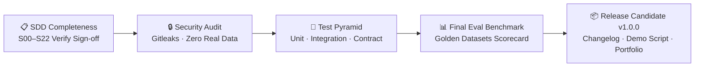

# Plan — S22 · Release / Portfolio

## 1. Approach

Execute the final release governance phase under `6.ops/release/`, `7.evals/`, and `8.docs/`. This plan establishes a systematic release verification pipeline: running security clearance audits, executing the full evaluation harness for the final benchmark scorecard, verifying SDD Definition of Done sign-offs, and preparing technical portfolio assets for public demonstration.

## 2. Architecture & Components

```
8.docs/
├── adr/                       # Completed ADR catalog (ADR-001 to ADR-012)
├── runbooks/                  # Production & local operation runbooks
└── portfolio/
    ├── README.md              # Technical portfolio showcase summary
    ├── demo_script.md         # Step-by-step interactive demo recording script
    └── video_curriculum.md    # Guide mapping the 20 YouTube/LinkedIn technical videos
7.evals/
└── reports/
    └── final_scorecard_v1.0.0.md # Final benchmark evaluation report
6.ops/
└── release/
    ├── release_checklist.py   # Automated DoD & SDD completeness auditor
    └── security_audit.sh      # Gitleaks / TruffleHog git history scanner
root/
├── CHANGELOG.md               # Version history and milestone deliverables (Q1–Q4)
└── README.md                  # Main portfolio landing page with badges and architecture
```

### Release Candidate Verification Pipeline:



## 3. Release Candidate Checklist & Automation

### Automated Verification Script (`6.ops/release/release_checklist.py`)
1. **SDD Catalog Audit:** Iterates through `1.SDDs/S00` to `1.SDDs/S22`:
   - Asserts `spec.md`, `plan.md`, `tasks.md`, and `verify.md` exist and are non-empty.
   - Parses `tasks.md` and asserts 0 unchecked `- [ ]` boxes.
   - Parses `verify.md` and asserts all evidence items are checked.
2. **Test Suite Verification:** Executes `pytest` with coverage report, verifying coverage $\ge 80\%$.
3. **Evaluation Benchmark Run:** Invokes `python -m evals.runner --final`, asserting all thresholds pass:
   - Intent Accuracy $\ge 90\%$
   - RAG Groundedness $\ge 90\%$
   - RAG Recall $\ge 85\%$
   - Safety / HITL Compliance $= 100\%$
4. **Security Scan:** Executes `gitleaks detect --source . -v`, ensuring zero hardcoded secrets.

## 4. Final Comparative Scorecard Design

The final evaluation report in `evals/reports/final_scorecard_v1.0.0.md` will record:
- **Baseline vs. Final Metrics Table:**
  - Intent Routing Accuracy (Target: >90%, Actual: XX%)
  - RAG Context Recall@k (Target: >85%, Actual: XX%)
  - RAG Groundedness / Faithfulness (Target: >90%, Actual: XX%)
  - MCP Tool Calling Accuracy (Target: >90%, Actual: XX%)
  - Human-in-the-Loop Safety Compliance (Target: 100%, Actual: 100%)
  - Average Latency per Turn (p50: ~1.2s, p95: ~2.8s on local Ollama)
- **Confusion Matrix:** Breakdown of intent classification across all 5 classes.
- **Guardrail Interception Rate:** Percentage of direct and indirect injection attacks neutralized (Target: 100%).

## 5. Portfolio Showcase & Demonstration Walkthrough

- **Interactive Demo Script (`docs/portfolio/demo_script.md`):**
  - Scenario 1: Regulatory inquiry about Central Bank essential tariff quotas (demonstrating RAG + citations).
  - Scenario 2: Synthetic customer profile and transaction history inspection (demonstrating MCP Customer Server).
  - Scenario 3: Loan and Consortium simulations (demonstrating deterministic financial calculations and disclaimers).
  - Scenario 4: Attempting to open a support ticket (demonstrating HITL action card, human confirmation, and execution).
  - Scenario 5: Malicious prompt injection attempt (demonstrating security guardrail refusal).

## 6. Risks & Mitigations

- **Risk:** Unchecked tasks or missing verify evidence discovered late in the release cycle.
  - **Mitigation:** Run `release_checklist.py` in strict mode early and provide clear diagnostic outputs pointing to incomplete files.
- **Risk:** Accidental leakage of local developer tokens in commit history.
  - **Mitigation:** Mandatory pre-release history scan with `trufflehog` and `gitleaks` prior to tagging `v1.0.0`.
