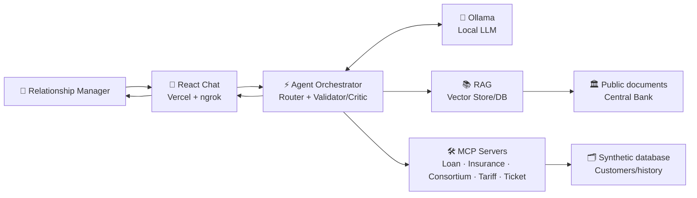
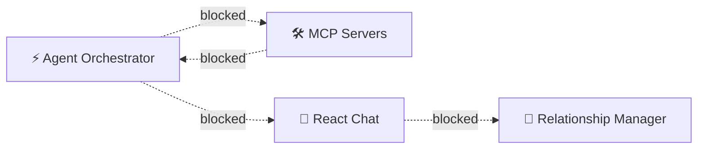

# Architecture — ATLAS · Banking GenAI Copilot

> **Status:** Approved · **Phase:** S00 · **Quarter:** Q1
> **Repository:** https://github.com/rogallan/atlas
> Companion document: `constitution.md` (non-negotiable principles)

## 1. Overview

ATLAS is a banking conversational copilot made up of six technical boundaries: **Front, API,
Agent, RAG, MCP, and Infra**. The frontend is published externally; everything else runs locally
during development, with a cloud infrastructure alternative via Terraform.

| Boundary   | Responsibility |
|---|---|
| **Front**  | React Chat: conversation UI, streaming, display of citations/sources and tool-call status, simulation/action-confirmation cards. Published on **Vercel**. |
| **API**    | FastAPI Gateway: contracts (OpenAPI), streaming (SSE), simulated authentication, payload validation, standardized error handling. Runs locally, exposed via **ngrok**. |
| **Agent**  | Agent orchestrator: Intent Router (classifies the message), a Validator/Critic node (grounding, schema, policy), step limit/timeout/fallback. Uses **Ollama** as the local LLM. |
| **RAG**    | Ingestion → chunking → embeddings → indexing → retrieval over the Central Bank's public document base, with traceable citations and explicit handling of missing evidence. |
| **MCP**    | Typed servers (Customer, Loan, Insurance, Consortium, Tariff, Ticket) exposing the synthetic customer/history database and executing fictitious operations/simulations, always with schema validation and — for actions — human confirmation. |
| **Infra**  | Local Docker (API + MCP + Vector Store/DB + Ollama); Terraform alternative for AWS (network, compute, data, observability, IAM/secrets). |

## 2. Lab environment

React Chat is published externally on **Vercel**; the application reaches the local infrastructure
through **ngrok**. Backend, MCP, Vector Store/DB, and Ollama remain local during development. The
architecture has a Terraform alternative for AWS, representing the same solution design in the
cloud.

## 3. Solution design

Flow of a request from the bank relationship manager, from React Chat to the copilot's response:

> This diagram is the Markdown version of the interactive solution design published in the PDI
> (HTML), in the section right below "PDI Objective". The nodes and connections are the same; the
> HTML version simply animates the flow step by step.

### 3.1 Flow steps

1. **Request via React Chat (Vercel + ngrok).** The relationship manager interacts with React
   Chat, published externally on Vercel. The request travels through the ngrok tunnel to the local
   FastAPI Gateway, which validates the payload and the simulated authentication.
2. **Intent routing with Ollama's support.** The FastAPI Gateway forwards the message to the Agent
   Orchestrator, which calls Ollama (local LLM) to classify the intent — *knowledge*, *query*,
   *simulation*, *action*, or *clarification* — with a validated, structured output (JSON schema).
3. **RAG (knowledge) or MCP (simulated operation).** Depending on the intent, the Orchestrator
   either queries the RAG pipeline over the Central Bank's public document base, or calls an MCP
   Server that queries the synthetic customer/history database and executes simulated operations
   (loan, insurance, consortium, tariffs, ticket).
4. **Validation, response, and return.** The agent's Validator/Critic node checks grounding,
   schema, and policy before returning the response, which flows back through the FastAPI Gateway
   → ngrok → React Chat (Vercel) to the manager, already streamed and with citations.

### 3.2 Guardrail: action without confirmation

Guardrail scenario (Security by default, see `constitution.md`): an action reaches the MCP Server
(e.g., opening a ticket) without explicit human confirmation. The Orchestrator's Validator/Critic
rejects the execution, logs the attempt for audit, and returns the block to the user — **no action
is executed without approval**.

## 4. Cloud infrastructure path (alternative)

The same logical architecture (Front/API/Agent/RAG/MCP) has an equivalent path on AWS, represented
by Terraform modules (network, compute, data, observability), with secrets and IAM configured
under the principle of least privilege. The frontend continues to be published on Vercel; Terraform
covers the alternative for the rest of the stack, which is local today.

## 5. Traceability

- Each component of this architecture maps to one or more items in the PDI's SDD catalog
  (S00 → S22) — for example: S03 (FastAPI Gateway), S04 (Ollama Provider), S05 (Intent Router),
  S06/S07 (RAG), S08–S13 (MCP Servers), S14 (Agent Graph), S15 (React Chat), S16 (ngrok), S20
  (Local Docker Stack), S21 (Terraform AWS).
- This file lives under `SDDs/S00-constitution/`, together with `constitution.md`, per the proposed
  project structure in the PDI.

## 6. References

- Repository: https://github.com/rogallan/atlas
- Blog: https://rogerallantex.blogspot.com/
- YouTube: https://www.youtube.com/@rogallany
