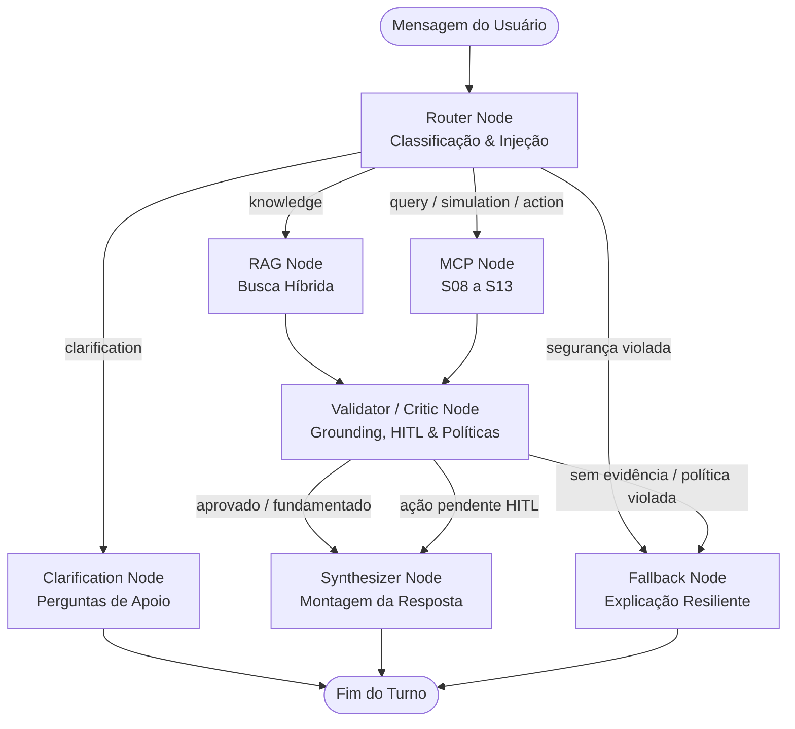

# ATLAS Agent Graph Orchestrator (S14)

Orquestrador central baseado em **Grafo de Estados Determinístico (State Graph)** do ATLAS Copilot. Coordena o fluxo de execução conversacional entre o Classificador de Intenções (S05), o Acervo Regulatório RAG (S06/S07) e os Servidores de Domínio MCP (S08 a S13), aplicando validação de evidências (*grounding*), defesas contra injeção de prompt e controle estrito de ações **Human-in-the-Loop (HITL)**.

---

## 1. O que este módulo faz

- **Grafo de Estados Central:** Executa uma máquina de estados explícita (`RouterNode` $\rightarrow$ `RAGNode` / `MCPNode` / `ClarificationNode` $\rightarrow$ `ValidatorNode` $\rightarrow$ `SynthesizerNode`).
- **Nó Validador / Crítico (`validator_node.py`):**
  - **Checagem de Ancoragem (*Grounding*):** Valida se afirmações conceituais ou regulatórias estão fundamentadas em chunks extraídos pela busca vetorial ou saídas de ferramentas.
  - **Controle de Ações Human-in-the-Loop:** Impede qualquer mutação direta de estado. Ações bancárias (como abertura de chamados) geram um cartão de confirmação interativo e um `confirmation_token` de 10 minutos. Somente após a aprovação humana afirmativa a alteração é efetivada.
  - **Conformidade e Políticas:** Bloqueia promessas de rentabilidade garantida, ativos proibidos ou termos de alto risco financeiro.
- **Defesa Adversarial e Injeção de Prompt (`injection.py`):** Neutraliza tentativas de jailbreak, substituição de prompt de sistema (*system prompt override*) e comandos maliciosos antes mesmo da execução.
- **Salvaguardas de Limite de Etapas e Anti-Loop:** Impõe um limite configurável de transições (padrão: 5 etapas). Se o fluxo entrar em ciclo ou exceder o limite, desvia de forma segura para o `FallbackNode`.

---

## 2. Topologia do Grafo de Estados



---

## 3. Estrutura de Diretórios

```
agent/
├── router/                 # S05 Intent Router
├── guardrails/             # Defesa de Prompt Injection (S14)
│   ├── __init__.py
│   └── injection.py
└── graph/                  # Máquina de Estados do Agente (S14)
    ├── __init__.py
    ├── state.py            # AgentState e enumerações de passos
    ├── edges.py            # Funções de roteamento condicional
    ├── orchestrator.py     # Compilador e loop de execução assíncrono
    └── nodes/              # Implementação de nós especializados
        ├── router_node.py
        ├── rag_node.py
        ├── mcp_node.py
        ├── clarification_node.py
        ├── validator_node.py
        ├── synthesizer_node.py
        └── fallback_node.py
```

---

## 4. Como Rodar

### 4.1 Demonstração Interativa (CLI)
Executa simulações de fluxo multirrota, validação de HITL em duas fases e bloqueio de injeção de prompt:
```bash
uv run python 6.ops/demo_agent_graph.py
```

Testar uma pergunta específica:
```bash
uv run python 6.ops/demo_agent_graph.py -q "Qual é o saldo da conta corrente de CUST-001?"
```

### 4.2 Execução Programática via Python
```python
import asyncio
from agent.graph.orchestrator import create_agent_graph


async def main():
    graph = create_agent_graph()
    state = await graph.process_turn(
        session_id="sess_001",
        message="Simule um empréstimo de R$ 10.000 em 24 meses para CUST-001",
    )
    print("Nós percorridos:", " -> ".join(state.node_history))
    print("Resposta:", state.final_response)


asyncio.run(main())
```

---

## 5. Testes Automatizados

Executar os testes de integração de ponta a ponta:
```bash
uv run pytest 4.tests/integration/test_agent_graph.py
```
