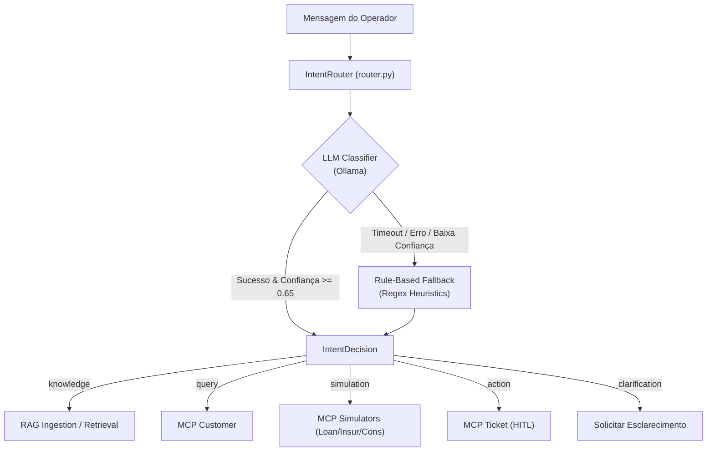

# ATLAS Agent — Intent Router (S05)

Módulo de **Roteamento Inteligente de Intenções** do ATLAS Copilot. Analisa mensagens de entrada do gerente de relacionamento e as classifica em 5 macro-intenções operacionais com pontuação de confiança, fallback determinístico baseado em regras e extração de entidades.

---

## 1. O que este módulo faz

- **Classificação de Intenções:**
  - `knowledge`: Dúvidas regulatórias (BACEN, CMN), regras de produtos ou políticas internas $\rightarrow$ Roteia para **RAG**.
  - `query`: Consulta de saldo, perfil cadastral ou contratos de um cliente $\rightarrow$ Roteia para **MCP Customer**.
  - `simulation`: Simulação de crédito, cotação de seguros ou cotas de consórcio $\rightarrow$ Roteia para **MCP Loan / Insurance / Consortium**.
  - `action`: Solicitação operacional com alteração de estado (abrir chamado, contestar) $\rightarrow$ Roteia para **MCP Ticket (HITL)**.
  - `clarification`: Prompts ambíguos, incompletos ou fora do escopo bancário.
- **Arquitetura Híbrida (LLM + Regras):**
  - **Classificador Primário:** Executa prompt few-shot no Ollama com saída estruturada em JSON Schema.
  - **Fallback Determinístico:** Expressões regulares e heurísticas léxicas acionadas instantaneamente caso o LLM falhe ou a confiança seja inferior a 0.65.
- **Auditoria de Decisão:** Retorna a justificativa (*reasoning*), pontuação de confiança (0.0 a 1.0) e latência em milissegundos.

---

## 2. Desenho da Solução



---

## 3. Modelo de Decisão (Pydantic)

```python
class IntentDecision(BaseModel):
    intent: IntentType  # knowledge | query | simulation | action | clarification
    confidence: float  # 0.0 a 1.0
    reasoning: str  # Justificativa da decisão
    extracted_entities: dict[str, Any]  # Ex: {"customer_id": "CUST-001"}
    route_target: str  # rag | mcp_customer | mcp_simulation | mcp_ticket
    latency_ms: float
```

---

## 4. Como Rodar e Testar

### 4.1 Teste Interativo via Código
```python
from agent.router.router import IntentRouter

router = IntentRouter()
decision = router.route(
    "Simule um empréstimo consignado de R$ 30.000 em 36 vezes para o cliente CUST-001"
)

print(f"Intenção: {decision.intent.value}")
print(f"Confiança: {decision.confidence:.2f}")
print(f"Destino: {decision.route_target}")
```

---

## 5. Testes Automatizados

```bash
uv run pytest 4.tests/unit/test_agent_router.py
```
*(Para benchmark de precisão com golden dataset: `uv run pytest 4.tests/evals/test_golden_intents.py`)*
