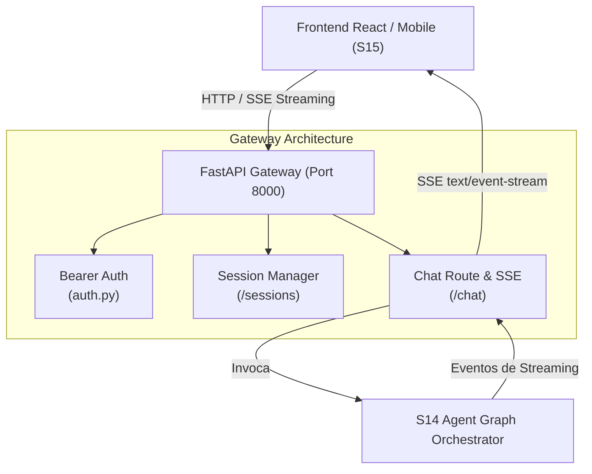

# ATLAS FastAPI Gateway (S03)

Gateway HTTP/REST central do ATLAS Copilot. Fornece a camada de entrada para a interface de usuário (React Chat no S15), gerenciamento de sessões, autenticação por Bearer Token, tratamento padronizado de erros e streaming de respostas conversacionais via Server-Sent Events (SSE).

---

## 1. O que este módulo faz

- **Gerenciamento de Sessões (`/sessions`):** Cria e gerencia ciclos de vida de conversas entre o gerente de relacionamento e o copilot com IDs de sessão únicos e controle de expiração.
- **Canal de Chat & Streaming SSE (`/chat`):** Recebe prompts dos operadores e encaminha para o orquestrador inteligente, entregando respostas progressivas via Server-Sent Events (SSE) para renderização em tempo real na interface web.
- **Autenticação & Segurança (`auth.py`):** Validação de tokens de autorização (`Authorization: Bearer <token>`) e injeção do contexto do operador nas requisições.
- **Padronização de Erros (`schemas.py`):** Envelopes estruturados de erro com códigos tipados, mensagens em português e detalhes de validação.
- **CORS & Suporte a Túneis (ngrok):** Configuração de CORS para desenvolvimento local e suporte a headers de skip de warning de proxies (ngrok).

---

## 2. Desenho da Solução



---

## 3. Endpoints Principais

| Método | Rota | Descrição |
|---|---|---|
| `GET` | `/health` | Verificação de integridade e prontidão do Gateway. |
| `POST` | `/sessions` | Inicializa uma nova sessão de atendimento para o operador. |
| `GET` | `/sessions/{session_id}` | Consulta o status e metadados de uma sessão ativa. |
| `POST` | `/chat` | Envia mensagem conversacional com suporte a streaming SSE. |
| `GET` | `/docs` | Documentação interativa OpenAPI (Swagger UI). |

---

## 4. Como Rodar

### 4.1 Iniciar o Gateway Localmente (Porta 8000)
```bash
uv run uvicorn api.main:app --host 127.0.0.1 --port 8000 --reload
```

### 4.2 Acessar a Documentação Swagger
Abra no navegador:
`http://127.0.0.1:8000/docs`

---

## 5. Exemplos de Uso

### Criar uma Nova Sessão
```bash
curl -X POST http://127.0.0.1:8000/sessions \
  -H "Authorization: Bearer test-token" \
  -H "Content-Type: application/json" \
  -d '{"customer_id": "CUST-001"}'
```

### Enviar Mensagem de Chat (Streaming)
```bash
curl -X POST http://127.0.0.1:8000/chat \
  -H "Authorization: Bearer test-token" \
  -H "Content-Type: application/json" \
  -H "Accept: text/event-stream" \
  -d '{
    "session_id": "sess_12345",
    "message": "Qual é a taxa de juros do crédito consignado para o cliente CUST-001?"
  }'
```

---

## 6. Testes Automatizados

```bash
uv run pytest 4.tests/unit/test_api_*.py
```
