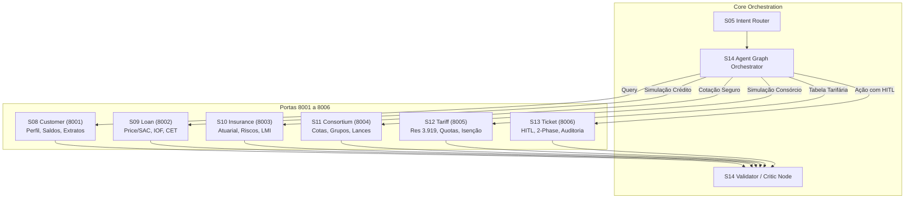

# ATLAS MCP Architecture — Domain Servers Ecosystem

Visão geral dos **6 Servidores Model Context Protocol (MCP)** do ATLAS Copilot. Cada servidor encapsula um subdomínio de negócio bancário com contratos estritos, esquemas Pydantic tipados, transporte duplo (stdio JSON-RPC 2.0 e HTTP/SSE) e isolamento de responsabilidades.

---

## 1. Mapa de Servidores MCP e Portas

| Sprint | Servidor MCP | Porta HTTP | Ferramentas Principais | Documentação |
|---|---|:---:|---|:---:|
| **S08** | **Customer Server** | `8001` | `get_customer_profile`, `get_account_balance`, `get_financial_history`, `list_active_products` | [README](file:///c:/Users/rogall/source/repos/atlas/2.src/mcp/customer/README.md) |
| **S09** | **Loan Server** | `8002` | `simulate_loan`, `get_loan_products`, `validate_loan_eligibility` | [README](file:///c:/Users/rogall/source/repos/atlas/2.src/mcp/loan/README.md) |
| **S10** | **Insurance Server** | `8003` | `quote_insurance`, `get_insurance_products`, `get_coverage_details` | [README](file:///c:/Users/rogall/source/repos/atlas/2.src/mcp/insurance/README.md) |
| **S11** | **Consortium Server** | `8004` | `simulate_consortium`, `project_bid`, `list_consortium_groups` | [README](file:///c:/Users/rogall/source/repos/atlas/2.src/mcp/consortium/README.md) |
| **S12** | **Tariff Server** | `8005` | `get_service_fee`, `list_tariff_packages`, `check_essential_services_quota`, `compare_packages` | [README](file:///c:/Users/rogall/source/repos/atlas/2.src/mcp/tariff/README.md) |
| **S13** | **Ticket Server** | `8006` | `prepare_ticket`, `confirm_and_create_ticket`, `get_ticket`, `list_customer_tickets` | [README](file:///c:/Users/rogall/source/repos/atlas/2.src/mcp/ticket/README.md) |

---

## 2. Desenho Arquitetural da Integração



---

## 3. Padrão de Execução e Transportes

Todos os servidores seguem uma estrutura padronizada:
- `models.py`: Entidades Pydantic de entrada, saída e exceções com códigos padronizados (`-32000` a `-32603`).
- `catalog.py` ou `store.py`: Repositório de dados com lógica de negócio pura e cálculos financeiros/atuariais determinísticos.
- `tools.py`: Camada de ferramentas que valida regras de negócio e aplica validações de segurança.
- `server.py`: Servidor JSON-RPC 2.0 stdio em conformidade com o protocolo oficial MCP.
- `http_server.py`: Servidor FastAPI com rotas REST e transporte Server-Sent Events (SSE) `/sse`.

---

## 4. Comandos Rápidos para Execução em Massa

### Subir individualmente qualquer servidor via HTTP:
```bash
uv run python 2.src/mcp/customer/http_server.py     # Porta 8001
uv run python 2.src/mcp/loan/http_server.py         # Porta 8002
uv run python 2.src/mcp/insurance/http_server.py    # Porta 8003
uv run python 2.src/mcp/consortium/http_server.py   # Porta 8004
uv run python 2.src/mcp/tariff/http_server.py       # Porta 8005
uv run python 2.src/mcp/ticket/http_server.py       # Porta 8006
```

### Rodar qualquer script de demonstração interativa:
```bash
uv run python 6.ops/demo_mcp_customer.py
uv run python 6.ops/demo_mcp_loan.py
uv run python 6.ops/demo_mcp_insurance.py
uv run python 6.ops/demo_mcp_consortium.py
uv run python 6.ops/demo_mcp_tariff.py
uv run python 6.ops/demo_mcp_ticket.py
```
