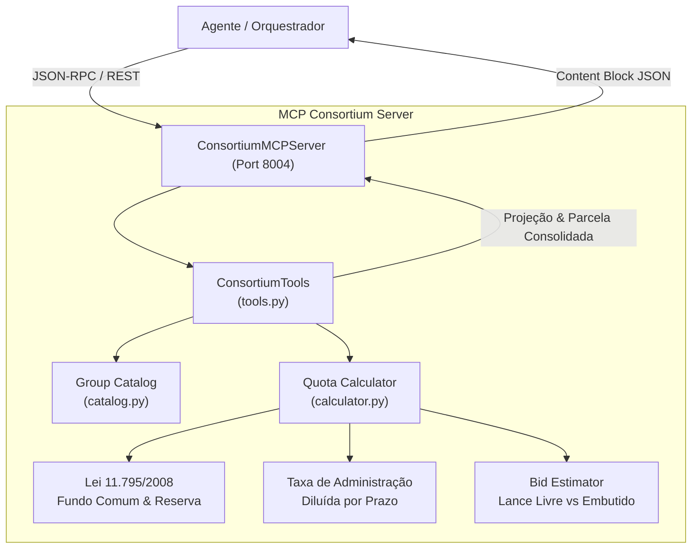

# ATLAS MCP Consortium Server (S11)

Servidor Model Context Protocol (MCP) especializado na **Simulação e Contabilidade de Cotas de Consórcio Bancário**. Modela a formação de grupos, taxas de administração, fundo de reserva, seguro prestamista e projeção probabilística de contemplação por lances livres e embutidos, em conformidade com a Lei nº 11.795/2008.

---

## 1. O que este módulo faz

- **Simulação de Cotas (`simulate_consortium`):** Calcula parcelas mensais compostas por parcela pura (amortização do crédito), taxa de administração total e mensal, fundo de reserva e seguro prestamista facultativo.
- **Projeção Estatística de Lances (`project_bid`):** Avalia a competitividade de lances livres e embutidos contra o histórico de lances vencedores do grupo selecionado, estimando probabilidades de contemplação (`alta`, `média`, `baixa`).
- **Catálogo de Grupos Ativos (`list_consortium_groups`):** Lista grupos abertos e em andamento para Imóveis, Automóveis, Veículos Pesados e Serviços, com saldo de cotas vagas e prazos remanescentes.

---

## 2. Desenho da Solução



---

## 3. Ferramentas Expostas (MCP Tools)

| Ferramenta | Parâmetros | Descrição |
|---|---|---|
| `simulate_consortium` | `product_type: str`, `credit_amount: float`, `term_months: int`, `has_insurance: bool?` | Simula cota com amortização pura, taxa de administração e parcelas. |
| `project_bid` | `group_id: str`, `bid_percentage: float`, `bid_type: str?` | Estima probabilidade de contemplação para lances livres ou embutidos. |
| `list_consortium_groups` | `product_type: str?` | Lista grupos disponíveis filtrados opcionalmente por modalidade. |

---

## 4. Como Rodar

### 4.1 Rodar a Demonstração Interativa (CLI)
```bash
uv run python 6.ops/demo_mcp_consortium.py --category real_estate --credit 350000 --term 180
```

### 4.2 Subir o Servidor HTTP / SSE (Porta 8004)
```bash
uv run python 2.src/mcp/consortium/http_server.py --port 8004
```
Endereços disponíveis:
- **Health Check:** `GET http://127.0.0.1:8004/health`
- **Ferramentas:** `GET http://127.0.0.1:8004/tools`
- **Swagger Docs:** `http://127.0.0.1:8004/docs`
- **MCP SSE Transport:** `GET http://127.0.0.1:8004/sse`
- **JSON-RPC:** `POST http://127.0.0.1:8004/mcp/jsonrpc`

### 4.3 Rodar no modo stdio
```bash
uv run python -m mcp.consortium.server
```

---

## 5. Exemplo de Simulação

### Chamada REST:
```bash
curl -X POST http://127.0.0.1:8004/tools/simulate_consortium \
  -H "Content-Type: application/json" \
  -d '{
    "product_type": "auto",
    "credit_amount": 80000.0,
    "term_months": 60,
    "has_insurance": true
  }'
```

### Resposta:
```json
{
  "result": {
    "product_type": "auto",
    "credit_amount": 80000.0,
    "term_months": 60,
    "pure_installment": 1333.33,
    "admin_fee_monthly": 200.0,
    "reserve_fund_monthly": 40.0,
    "insurance_monthly": 64.0,
    "total_monthly_installment": 1637.33,
    "admin_fee_total_pct": 0.15,
    "reserve_fund_total_pct": 0.03
  }
}
```

---

## 6. Testes Automatizados

```bash
uv run pytest 4.tests/unit/test_mcp_consortium.py
```
