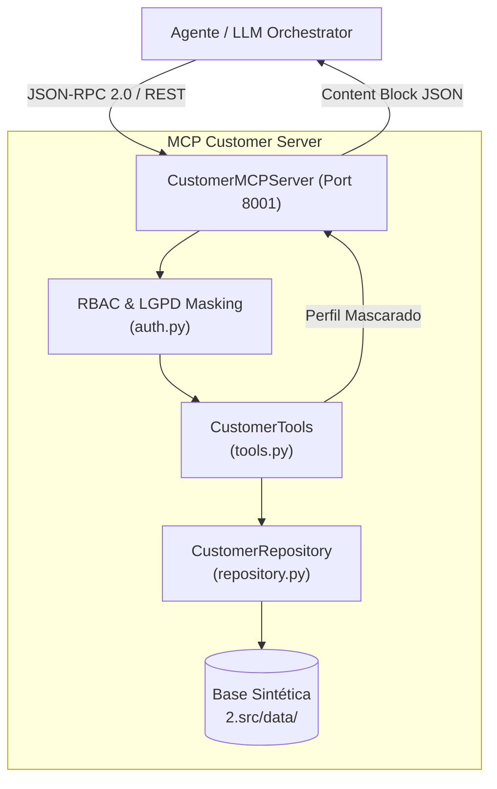

# ATLAS MCP Customer Server (S08)

Servidor Model Context Protocol (MCP) responsável pelo domínio de **Clientes e Contas Bancárias**. Expõe consultas estruturadas à base sintética com mascaramento de dados sensíveis (LGPD), validação de papéis de acesso (RBAC) e transportes duplos (stdio JSON-RPC e HTTP/SSE).

---

## 1. O que este módulo faz

- **Consulta de Perfil de Cliente (`get_customer_profile`):** Retorna dados cadastrais, segmentação (`retail`, `prime`, `private`, `corporate_smb`), limites de crédito e score sintético.
- **Consulta de Saldo e Contas (`get_account_balance`):** Consulta saldos de conta corrente e poupança, status da conta e limites de cheque especial.
- **Histórico Financeiro (`get_financial_history`):** Extrato de transações com filtros de período (dias) e tipo de evento financeiro (`pix_in`, `pix_out`, `salary_deposit`, etc.).
- **Lista de Produtos Ativos (`list_active_products`):** Relaciona contratos ativos de empréstimos, seguros, consórcios e cartões.
- **Segurança & LGPD:** Aplica mascaramento dinâmico em CPF, agência e conta conforme o nível de autorização do operador (`relationship_manager`, `analyst`, `compliance`).

---

## 2. Desenho da Solução



---

## 3. Ferramentas Expostas (MCP Tools)

| Ferramenta | Parâmetros | Descrição |
|---|---|---|
| `get_customer_profile` | `customer_id: str` | Retorna o perfil cadastral e de relacionamento mascarado. |
| `get_account_balance` | `customer_id: str`, `account_id: str?` | Retorna os saldos consolidados e limites disponíveis. |
| `get_financial_history` | `customer_id: str`, `days: int`, `event_type: str?` | Extrato transacional filtrado por período e tipo de movimentação. |
| `list_active_products` | `customer_id: str` | Lista os contratos bancários vigentes do cliente. |

---

## 4. Como Rodar

### Pré-requisitos
Ter o ambiente virtual sincronizado via `uv`:
```bash
uv sync
```

### 4.1 Rodar a Demonstração Interativa (CLI)
```bash
uv run python 6.ops/demo_mcp_customer.py --customer-id CUST-001
```

### 4.2 Subir o Servidor HTTP / SSE (Porta 8001)
```bash
uv run python 2.src/mcp/customer/http_server.py --port 8001
```
Endereços disponíveis:
- **Health Check:** `GET http://127.0.0.1:8001/health`
- **Catálogo de Ferramentas:** `GET http://127.0.0.1:8001/tools`
- **Swagger Docs:** `http://127.0.0.1:8001/docs`
- **MCP SSE Transport:** `GET http://127.0.0.1:8001/sse`
- **JSON-RPC Endpoint:** `POST http://127.0.0.1:8001/mcp/jsonrpc`

### 4.3 Rodar no modo stdio (para Claude Desktop / Agente CLI)
```bash
uv run python -m mcp.customer.server
```

---

## 5. Exemplos de Uso

### Chamada REST direta:
```bash
curl -X POST http://127.0.0.1:8001/tools/get_customer_profile \
  -H "Content-Type: application/json" \
  -d '{"customer_id": "CUST-001"}'
```

### Resposta esperada:
```json
{
  "result": {
    "customer_id": "CUST-001",
    "name": "Carlos Eduardo da Silva",
    "cpf_masked": "123.***.***-45",
    "segment": "prime",
    "risk_profile": "moderate",
    "monthly_income": 12500.0,
    "total_investments": 145000.0
  }
}
```

---

## 6. Testes Automatizados

Executar os testes unitários e contratuais deste servidor:
```bash
uv run pytest 4.tests/unit/test_mcp_customer.py
```
