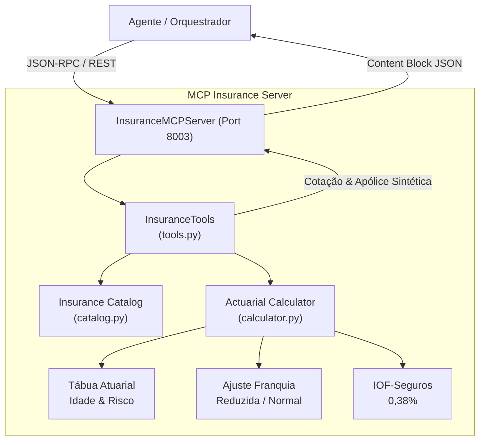

# ATLAS MCP Insurance Server (S10)

Servidor Model Context Protocol (MCP) especializado na **Cotação Atuarial e Parametrização de Seguros Bancários**. Modela faixas etárias, riscos ocupacionais, franquias, assistências 24h e alíquota tributária de IOF-Seguros (0,38% conforme Decreto nº 6.306/2007).

---

## 1. O que este módulo faz

- **Cotação Atuarial (`quote_insurance`):** Calcula prêmios líquidos, adicionais por coberturas facultativas, alíquota de IOF e prêmio total a partir de fatores como faixa etária, perfil ocupacional e valor segurado (LMI).
- **Detalhamento de Coberturas e Franquias (`get_coverage_details`):** Especifica coberturas básicas (morte, invalidez, colisão, roubo), adicionais e regras de franquia (reduzida, normal, majorada).
- **Catálogo de Ramos de Seguro (`get_insurance_products`):** Lista modalidades ativas: Vida Individual, Auto, Residencial, Viagem e Proteção Financeira / Cartão Protegido.

---

## 2. Desenho da Solução



---

## 3. Ferramentas Expostas (MCP Tools)

| Ferramenta | Parâmetros | Descrição |
|---|---|---|
| `quote_insurance` | `customer_id: str`, `product_type: str`, `coverage_amount: float`, `deductible_type: str?`, `additional_coverages: list[str]?` | Calcula cotação de seguro com prêmio líquido, IOF e prêmio total. |
| `get_insurance_products` | *(Nenhum)* | Retorna o catálogo de produtos de seguro e limites de LMI. |
| `get_coverage_details` | `product_type: str` | Apresenta condições contratuais, franquias e carências. |

---

## 4. Como Rodar

### 4.1 Rodar a Demonstração Interativa (CLI)
```bash
uv run python 6.ops/demo_mcp_insurance.py --product life_insurance --coverage 300000
```

### 4.2 Subir o Servidor HTTP / SSE (Porta 8003)
```bash
uv run python 2.src/mcp/insurance/http_server.py --port 8003
```
Endereços disponíveis:
- **Health Check:** `GET http://127.0.0.1:8003/health`
- **Ferramentas:** `GET http://127.0.0.1:8003/tools`
- **Swagger Docs:** `http://127.0.0.1:8003/docs`
- **MCP SSE Transport:** `GET http://127.0.0.1:8003/sse`
- **JSON-RPC:** `POST http://127.0.0.1:8003/mcp/jsonrpc`

### 4.3 Rodar no modo stdio
```bash
uv run python -m mcp.insurance.server
```

---

## 5. Exemplo de Cotação

### Chamada REST:
```bash
curl -X POST http://127.0.0.1:8003/tools/quote_insurance \
  -H "Content-Type: application/json" \
  -d '{
    "customer_id": "CUST-001",
    "product_type": "life_insurance",
    "coverage_amount": 250000.0,
    "deductible_type": "normal",
    "additional_coverages": ["invalidez_permanente"]
  }'
```

### Resposta:
```json
{
  "result": {
    "product_type": "life_insurance",
    "coverage_amount": 250000.0,
    "net_premium_monthly": 85.50,
    "iof_tax": 0.33,
    "total_premium_monthly": 85.83,
    "deductible_type": "normal",
    "age_bracket": "36-45",
    "risk_multiplier": 1.15
  }
}
```

---

## 6. Testes Automatizados

```bash
uv run pytest 4.tests/unit/test_mcp_insurance.py
```
