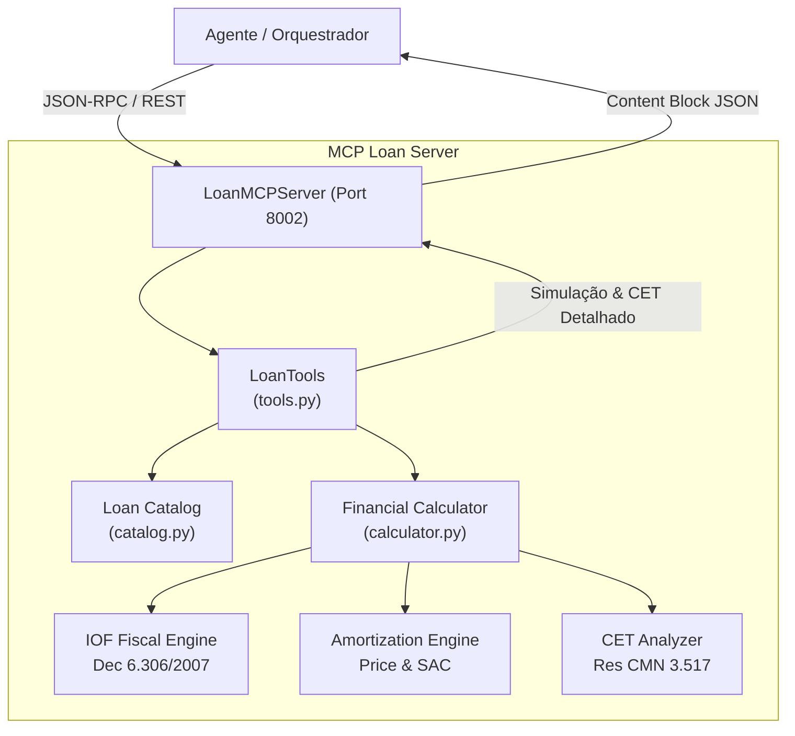

# ATLAS MCP Loan Server (S09)

Servidor Model Context Protocol (MCP) especializado na **Simulação e Validação de Operações de Crédito e Financiamento**. Realiza cálculos financeiros em conformidade com as normas do Banco Central do Brasil (BACEN) e regulamentação de IOF (Decreto nº 6.306/2007).

---

## 1. O que este módulo faz

- **Simulação de Crédito (`simulate_loan`):** Calcula parcelas pelos sistemas de amortização **PRICE** (parcelas fixas) e **SAC** (amortização constante), apuração diária e adicional de IOF, e cálculo do **Custo Efetivo Total (CET)** nominal e anual conforme Resolução CMN nº 3.517.
- **Validação de Elegibilidade (`validate_loan_eligibility`):** Avalia se a parcela mensal pretendida respeita o limite de comprometimento de renda (30% para crédito pessoal e 35% para consignado), risco de crédito e política interna.
- **Catálogo de Linhas de Crédito (`get_loan_products`):** Lista taxas de juros mínimas/máximas, prazos e faixas de valores para Crédito Pessoal, Consignado, Capital de Giro e Home Equity.

---

## 2. Desenho da Solução



---

## 3. Ferramentas Expostas (MCP Tools)

| Ferramenta | Parâmetros | Descrição |
|---|---|---|
| `simulate_loan` | `customer_id: str`, `product_type: str`, `requested_amount: float`, `term_months: int`, `amortization_system: str?` | Simula crédito com amortização Price/SAC, IOF e CET. |
| `get_loan_products` | *(Nenhum)* | Retorna o catálogo de produtos de crédito com taxas e limites. |
| `validate_loan_eligibility` | `customer_id: str`, `requested_amount: float`, `term_months: int`, `product_type: str` | Avalia capacidade de pagamento e margem consignável. |

---

## 4. Como Rodar

### 4.1 Rodar a Demonstração Interativa (CLI)
```bash
uv run python 6.ops/demo_mcp_loan.py --amount 25000 --term 36 --product payroll_loan
```

### 4.2 Subir o Servidor HTTP / SSE (Porta 8002)
```bash
uv run python 2.src/mcp/loan/http_server.py --port 8002
```
Endereços disponíveis:
- **Health Check:** `GET http://127.0.0.1:8002/health`
- **Ferramentas:** `GET http://127.0.0.1:8002/tools`
- **Swagger Docs:** `http://127.0.0.1:8002/docs`
- **MCP SSE Transport:** `GET http://127.0.0.1:8002/sse`
- **JSON-RPC:** `POST http://127.0.0.1:8002/mcp/jsonrpc`

### 4.3 Rodar no modo stdio
```bash
uv run python -m mcp.loan.server
```

---

## 5. Exemplo de Simulação

### Chamada REST:
```bash
curl -X POST http://127.0.0.1:8002/tools/simulate_loan \
  -H "Content-Type: application/json" \
  -d '{
    "customer_id": "CUST-001",
    "product_type": "personal_credit",
    "requested_amount": 10000.0,
    "term_months": 24,
    "amortization_system": "price"
  }'
```

### Resposta:
```json
{
  "result": {
    "product_type": "personal_credit",
    "requested_amount": 10000.0,
    "net_disbursed_amount": 10000.0,
    "total_iof": 338.40,
    "monthly_installment": 562.15,
    "total_payable": 13491.60,
    "interest_rate_monthly": 0.0249,
    "cet_monthly": 0.0268,
    "cet_annual": 0.3732,
    "income_commitment_pct": 0.045,
    "eligible": true
  }
}
```

---

## 6. Testes Automatizados

```bash
uv run pytest 4.tests/unit/test_mcp_loan.py
```
