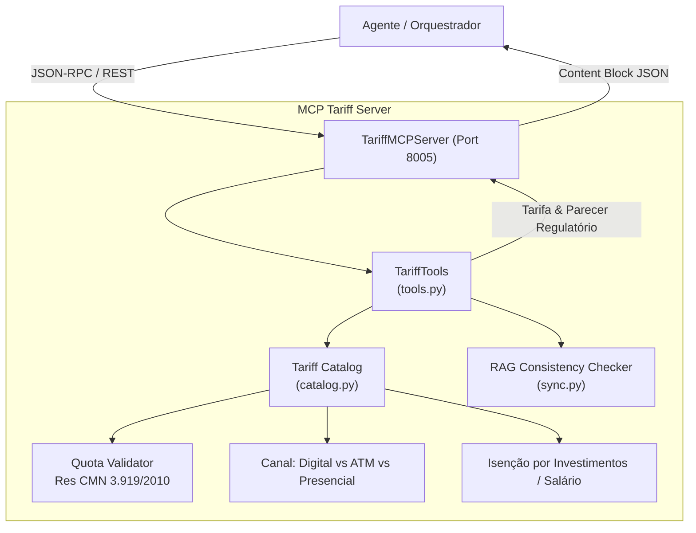

# ATLAS MCP Tariff Server (S12)

Servidor Model Context Protocol (MCP) responsável pela **Tabela de Tarifas Bancárias, Pacotes de Serviços e Franquias Gratuitas Essenciais**. Implementa rigorosamente as regras da **Resolução CMN nº 3.919/2010**, Resolução BCB nº 1/2020 (Pix) e verificação de consistência com a base de conhecimento RAG.

---

## 1. O que este módulo faz

- **Consulta de Tarifa Unitária Avulsa (`get_service_fee`):** Retorna o valor de serviços avulsos (saques, extratos, transferências TED/DOC) com diferenciação por canal de atendimento (**digital**, **ATM / autoatendimento** ou **guichê presencial**), acompanhado do fundamento regulatório oficial do Banco Central.
- **Validação de Franquia Gratuita (`check_essential_services_quota`):** Verifica se a transação do cliente está dentro da franquia mensal obrigatória gratuita garantida pela Resolução CMN nº 3.919/2010 (ex.: 4 saques gratuitos/mês, 2 extratos de 30 dias/mês, consultas ilimitadas pela internet).
- **Pacotes de Serviços e Comparação (`list_tariff_packages`, `compare_packages`):** Lista cestas de serviços (Essencial Gratuito, Clássico, Prime, Private) e calcula regras de isenção total de tarifa com base em volume de investimentos, portabilidade de salário ou gastos no cartão de crédito.
- **Consistência Bidirecional com RAG:** Módulo de auditoria que garante que os valores numéricos retornados pelo MCP coincidam perfeitamente com os documentos regulatórios indexados no RAG vetorial.

---

## 2. Desenho da Solução



---

## 3. Ferramentas Expostas (MCP Tools)

| Ferramenta | Parâmetros | Descrição |
|---|---|---|
| `get_service_fee` | `service_name: str`, `channel: str?` | Consulta a tarifa de serviço por canal com embasamento BACEN. |
| `list_tariff_packages` | *(Nenhum)* | Lista todos os pacotes de tarifas e franquias inclusas. |
| `check_essential_services_quota` | `service_name: str`, `used_in_month: int` | Avalia se a transação está coberta pela franquia legal gratuita. |
| `compare_packages` | `customer_segment: str?` | Compara cestas de serviços e regras de isenção de mensalidade. |

---

## 4. Como Rodar

### 4.1 Rodar a Demonstração Interativa (CLI)
```bash
uv run python 6.ops/demo_mcp_tariff.py --service withdrawal --channel branch_counter --used 4
```

### 4.2 Subir o Servidor HTTP / SSE (Porta 8005)
```bash
uv run python 2.src/mcp/tariff/http_server.py --port 8005
```
Endereços disponíveis:
- **Health Check:** `GET http://127.0.0.1:8005/health`
- **Ferramentas:** `GET http://127.0.0.1:8005/tools`
- **Swagger Docs:** `http://127.0.0.1:8005/docs`
- **MCP SSE Transport:** `GET http://127.0.0.1:8005/sse`
- **JSON-RPC:** `POST http://127.0.0.1:8005/mcp/jsonrpc`

### 4.3 Rodar no modo stdio
```bash
uv run python -m mcp.tariff.server
```

---

## 5. Exemplo de Consulta de Tarifa e Franquia

### Chamada REST:
```bash
curl -X POST http://127.0.0.1:8005/tools/check_essential_services_quota \
  -H "Content-Type: application/json" \
  -d '{
    "service_name": "withdrawal",
    "used_in_month": 4
  }'
```

### Resposta:
```json
{
  "result": {
    "service_name": "withdrawal",
    "monthly_free_quota": 4,
    "used_in_month": 4,
    "is_within_quota": false,
    "fee_applicable": 2.90,
    "message": "Franquia gratuita mensal de 4 saques esgotada. Próximo saque tarifado em R$ 2,90 (ATM) conforme Resolução CMN nº 3.919/2010."
  }
}
```

---

## 6. Testes Automatizados

```bash
uv run pytest 4.tests/unit/test_mcp_tariff.py
```
