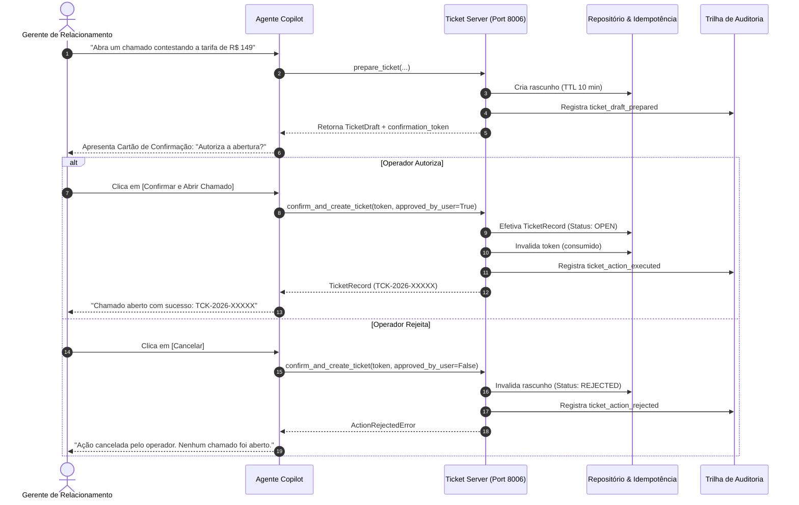

# ATLAS MCP Ticket Server (S13)

Servidor Model Context Protocol (MCP) que gerencia o ciclo de vida de **Chamados de Suporte e Solicitações Operacionais Bancárias**. É o primeiro componente com capacidade de alteração de estado no ATLAS, implementando estritamente o padrão **Human-in-the-Loop (HITL)** em duas fases, proteção por idempotência e trilha de auditoria de segurança.

---

## 1. O que este módulo faz

- **Fase 1: Preparação de Rascunho (`prepare_ticket`):** Valida a intenção e os dados fornecidos pelo cliente/gerente, gera um rascunho de chamado e emite um `confirmation_token` criptográfico de uso único com TTL de 10 minutos. **Nenhuma alteração de estado definitivo ocorre nesta etapa.**
- **Fase 2: Execução com Confirmação Humana (`confirm_and_create_ticket`):** Efetiva a gravação do chamado somente quando o operador humano autoriza explicitamente (`approved_by_user == True`) portando um token válido e não expirado.
- **Guardrail de Rejeição e Segurança:** Se o operador rejeitar ou o token estiver expirado, a ação é bloqueada, o rascunho é invalidado e o evento é registrado na trilha de auditoria como `ticket_action_rejected`.
- **Garantia de Idempotência:** Chaves de idempotência fornecidas pelo cliente evitam duplicidade de chamados em cenários de reenvio ou instabilidade de rede.
- **Trilha de Auditoria Estruturada (`audit.py`):** Registra cada evento (preparação, execução, rejeição, expiração) com operador, cliente, protocolo e carimbo de tempo UTC.
- **Consulta e Histórico (`get_ticket`, `list_customer_tickets`):** Consulta status de resolução e histórico de chamados do cliente.

---

## 2. Desenho da Solução



---

## 3. Ferramentas Expostas (MCP Tools)

| Ferramenta | Parâmetros | Descrição |
|---|---|---|
| `prepare_ticket` | `customer_id: str`, `category: str`, `title: str`, `description: str`, `priority: str?`, `idempotency_key: str?` | Fase 1: Valida solicitação e emite `confirmation_token` com TTL de 10 min. |
| `confirm_and_create_ticket` | `confirmation_token: str`, `approved_by_user: bool`, `idempotency_key: str?` | Fase 2: Executa abertura do chamado mediante aprovação humana obrigatória. |
| `get_ticket` | `ticket_id: str` | Consulta status, operador e detalhes do chamado. |
| `list_customer_tickets` | `customer_id: str` | Lista histórico de chamados abertos para o cliente. |

---

## 4. Como Rodar

### 4.1 Rodar a Demonstração Interativa (CLI)
Fluxo completo com confirmação e idempotência:
```bash
uv run python 6.ops/demo_mcp_ticket.py --customer-id CUST-001
```

Fluxo simulando recusa humana pelo operador:
```bash
uv run python 6.ops/demo_mcp_ticket.py --reject
```

### 4.2 Subir o Servidor HTTP / SSE (Porta 8006)
```bash
uv run python 2.src/mcp/ticket/http_server.py --port 8006
```
Endereços disponíveis:
- **Health Check:** `GET http://127.0.0.1:8006/health`
- **Ferramentas:** `GET http://127.0.0.1:8006/tools`
- **Swagger Docs:** `http://127.0.0.1:8006/docs`
- **MCP SSE Transport:** `GET http://127.0.0.1:8006/sse`
- **JSON-RPC:** `POST http://127.0.0.1:8006/mcp/jsonrpc`

### 4.3 Rodar no modo stdio
```bash
uv run python -m mcp.ticket.server
```

---

## 5. Exemplo de Execução em Duas Fases

### Fase 1: Preparação via REST
```bash
curl -X POST http://127.0.0.1:8006/tools/prepare_ticket \
  -H "Content-Type: application/json" \
  -d '{
    "customer_id": "CUST-001",
    "category": "contestation",
    "title": "Contestação de lançamento duplicado",
    "description": "Cliente relata cobrança em dobro de R$ 149,90 no débito."
  }'
```
Retorna `confirmation_token: "tkn_AbCd123..."`.

### Fase 2: Confirmação do Operador
```bash
curl -X POST http://127.0.0.1:8006/tools/confirm_and_create_ticket \
  -H "Content-Type: application/json" \
  -d '{
    "confirmation_token": "tkn_AbCd123...",
    "approved_by_user": true,
    "operator_id": "manager_001"
  }'
```

---

## 6. Testes Automatizados

```bash
uv run pytest 4.tests/unit/test_mcp_ticket.py
```
