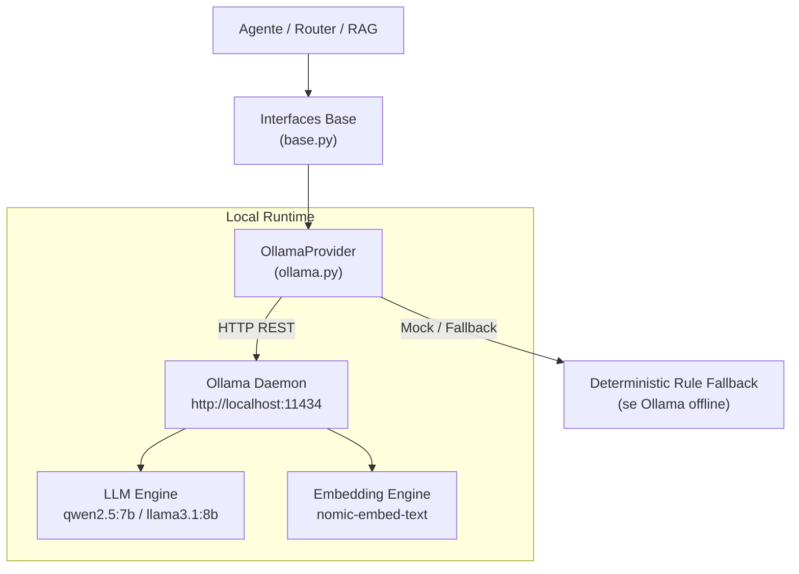

# ATLAS Providers — Local LLM & Embeddings (S04)

Camada de abstração e integração com modelos de linguagem locais (LLM) e geradores de embeddings via **Ollama**. Garante privacidade total dos dados bancários ao executar inferência 100% on-premises / local sem vazamento para APIs de nuvem pública.

---

## 1. O que este módulo faz

- **Integração com Ollama Local (`ollama.py`):** Conecta ao daemon local do Ollama (`http://localhost:11434`) para geração de texto, chamadas estruturadas e extração de embeddings.
- **Modelos Homologados:**
  - **LLM Principal:** `qwen2.5:7b-instruct` (excelente aderência a instruções e geração em português) ou `llama3.1:8b-instruct`.
  - **Embeddings Vetoriais:** `nomic-embed-text` (vetor de 768 dimensões com normalização).
- **Modo Estruturado (JSON Mode):** Força o LLM a responder em esquemas JSON estritos quando necessário (ex.: classificação de intenções e chamadas de ferramentas).
- **Resiliência e Fallback:** Detecção automática de indisponibilidade do Ollama, retentativas exponenciais e fallbacks determinísticos para testes unitários em CI.

---

## 2. Desenho da Solução



---

## 3. Configuração de Ambiente

As configurações são lidas a partir de variáveis de ambiente ou arquivo `.env`:

```env
OLLAMA_BASE_URL=http://localhost:11434
OLLAMA_LLM_MODEL=qwen2.5:7b
OLLAMA_EMBED_MODEL=nomic-embed-text
OLLAMA_TIMEOUT=60
OLLAMA_MAX_RETRIES=3
```

---

## 4. Como Rodar e Testar

### 4.1 Verificar se o Ollama está em execução
```bash
ollama list
```
Para baixar os modelos necessários:
```bash
ollama pull qwen2.5:7b
ollama pull nomic-embed-text
```

### 4.2 Teste Rápido via Python
```python
from providers.ollama import OllamaProvider

provider = OllamaProvider()
response = provider.generate("Explique brevemente o que é CET bancário em 2 linhas.")
print(response)
```

---

## 5. Testes Automatizados

```bash
uv run pytest 4.tests/unit/test_providers_ollama.py
```
*(Para executar avaliações ao vivo com o Ollama local rodando: `RUN_LIVE_LLM_EVAL=1 uv run pytest 4.tests/evals/`)*
