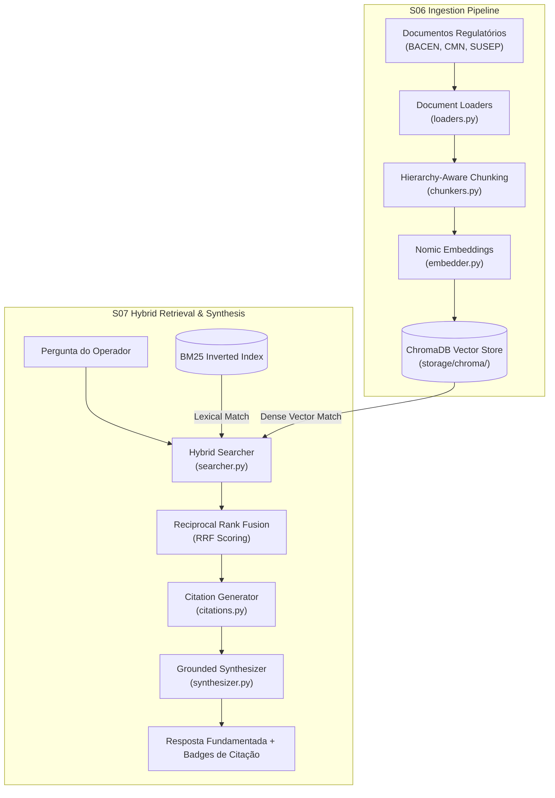

# ATLAS RAG — Ingestion, Hybrid Retrieval & Grounded Synthesis (S06 / S07)

Módulo de **Recuperação Aumentada por Geração (RAG)** do ATLAS Copilot. Responsável pela ingestão de normativos regulatórios (BACEN, CMN, SUSEP), chunking semântico estruturado, indexação vetorial no ChromaDB, busca híbrida (Denso + Léxico BM25) e síntese com ancoragem obrigatória de citações.

---

## 1. O que este módulo faz

- **Ingestão Documental (`ingestion/` - S06):**
  - Carregadores de documentos regulatórios (PDFs, Markdown e manuais de políticas bancárias).
  - **Chunker Ciente de Hierarquia:** Preserva títulos, artigos, parágrafos e incisos sem quebrar o contexto normativo.
  - Extração de metadados: Órgão emissor (`BACEN`, `CMN`, `SUSEP`), número da norma, ano e tema.
  - Geração de embeddings via `nomic-embed-text` e persistência no banco vetorial **ChromaDB**.
- **Recuperação Híbrida (`retrieval/` - S07):**
  - **Busca Híbrida:** Combina busca semântica densa (similaridade de cosseno vetorial) com busca léxica (BM25) para capturar tanto termos técnicos exatos quanto similaridades conceituais.
  - **Reciprocal Rank Fusion (RRF):** Algoritmo de fusão ponderada para ordenar os chunks mais relevantes.
  - **Motor de Citações (`citations.py`):** Ancoragem obrigatória de afirmações com badges de citação (`[Fonte: Resolução CMN nº 3.919/2010, Art. 2º]`), garantindo *grounding* e prevenindo alucinações.

---

## 2. Desenho da Solução



---

## 3. Estrutura de Diretórios

```
rag/
├── models.py               # Esquemas: DocumentChunk, SearchQuery, RetrievalResult, Citation
├── storage/                # Diretório local do ChromaDB
├── ingestion/              # Pipeline S06
│   ├── loaders.py          # Leitor de arquivos markdown e normativos
│   ├── chunkers.py         # Divisão de texto estruturada por títulos
│   ├── embedder.py         # Interface de vetorização
│   ├── store.py            # Repositório de persistência vetorial
│   └── pipeline.py         # Orquestrador de ponta a ponta
└── retrieval/              # Mecanismo de Busca S07
    ├── searcher.py         # Motor de busca híbrida (Dense + BM25)
    ├── citations.py        # Validação de citações e ancoragem
    ├── synthesizer.py      # Geração de resposta condicionada
    └── service.py          # Serviço unificado de consulta
```

---

## 4. Como Rodar e Ingerir Documentos

### 4.1 Executar a Ingestão dos Normativos
Para processar e indexar a pasta de documentos em `3.docs/`:
```bash
uv run python -m rag.ingestion.pipeline
```

### 4.2 Executar uma Consulta RAG via Código
```python
from rag.retrieval.service import RetrievalService

service = RetrievalService()
result = service.query("Quantos saques gratuitos por mês um cliente tem direito na conta corrente?")

print(result.answer)
for citation in result.citations:
    print(f"- {citation.document_title} ({citation.section}): {citation.quote}")
```

---

## 5. Testes Automatizados

```bash
uv run pytest 4.tests/unit/test_rag_*.py
```
*(Para avaliação de precisão de recuperação e relevância: `uv run pytest 4.tests/evals/test_rag_retrieval.py`)*
