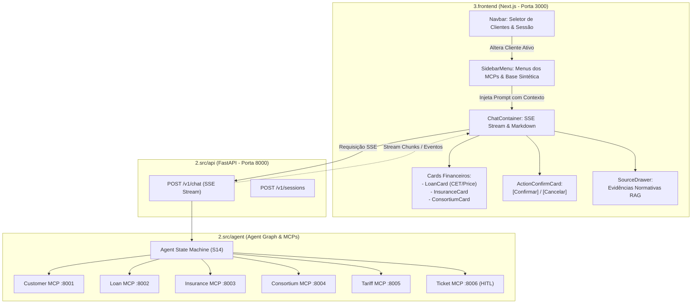

# ATLAS — Next.js React Chat Copilot

Interface conversacional e painel de relacionamento bancário do projeto **ATLAS**, desenvolvida com **Next.js (App Router)**, **React 18** e **TypeScript**. Conecta os gerentes de conta à malha de inteligência do ATLAS através do Gateway FastAPI (`/v1/chat`), suportando streaming em tempo real via Server-Sent Events (SSE), widgets interativos de simulação financeira, gaveta de evidências documentais (RAG Grounding) e governança estrita **Human-in-the-Loop (HITL)** para operações de escrita.

---

## 1. Arquitetura da Solução e Menus dos MCPs



---

## 2. Menus Integrados com os MCPs e Base de Dados

O painel lateral (`SidebarMenu`) categoriza de forma clara os serviços e microserviços bancários com atalhos de 1 clique associados ao cliente ativo:

### 2.1. Base de Dados Sintética de Clientes
- **Seletor de Clientes Reais:** Permite alternar instantaneamente entre clientes sintéticos da base (`CUST-0001` Roberto Santos a `CUST-0020`), exibindo em tempo real:
  - Nome completo e conta corrente ativa.
  - Segmento bancário (`RETAIL`, `PRIME`, `PRIVATE`, `CORPORATE`).
  - Renda mensal declarada e Score de Crédito com badge dinâmico de risco.

### 2.2. Categorias dos Servidores MCP
| Menu | MCP Correspondente | Porta | Capacidades e Consultas Pré-Configuradas |
| :--- | :--- | :--- | :--- |
| 👥 **Clientes & Contas** | Customer MCP | `8001` | Consulta de saldo consolidado, contas correntes e poupança, extrato recente e score com mascaramento LGPD. |
| 💳 **Crédito & Empréstimos** | Loan MCP | `8002` | Simulação de crédito pessoal com CET anual, primeira parcela em amortização Price/SAC e crédito automotivo com carência. |
| 🛡️ **Seguros & Proteção** | Insurance MCP | `8003` | Cotações dinâmicas de seguro de vida individual, seguro residencial com coberturas multirrisco e seguro auto. |
| 🏢 **Consórcios** | Consortium MCP | `8004` | Simulação de cotas de consórcio de imóveis (R$ 300k) e veículos (R$ 80k), com taxas de administração e cenários de lances. |
| 📋 **Tarifas & BACEN** | Tariff MCP & RAG | `8005` | Consulta de gratuidades obrigatórias (Resolução CMN 3.919/2010), tabela de tarifas avulsas e pacotes padronizados. |
| 🎫 **Chamados & HITL** | Ticket MCP | `8006` | Abertura de chamados com governança de 2 etapas (contestação de cartão, revisão de limites) com botões de confirmação. |

---

## 3. Funcionalidades da Interface Conversacional

1. **Streaming em Tempo Real (SSE):** O chat consome `POST /v1/chat` e apresenta os tokens progressivamente sem travamentos.
2. **Citações com Gaveta de Evidências (`SourceDrawer`):** Ao citar normas do Banco Central ou CMN, chips interativos como `[Resolução CMN 3.919]` são renderizados. Clicar no chip abre a gaveta lateral com o artigo, título e trecho literal indexado.
3. **Cards Estruturados de Simulação Financeira:**
   - **LoanCard:** Exibe valor solicitado, parcela mensal, CET (% a.a.), taxa de juros e o disclaimer obrigatório não-vinculante.
   - **InsuranceCard:** Exibe plano, capital segurado, prêmio mensal com IOF e ressalvas de subscrição da SUSEP.
   - **ConsortiumCard:** Exibe carta de crédito, taxa administrativa, prazo e valor das parcelas.
4. **Card Human-in-the-Loop (HITL):**
   - Intercepta ações de escrita no sistema bancário com borda de segurança âmbar.
   - Apresenta resumo da transação e token `tkn_...`.
   - Botões explícitos **[Confirmar Ação]** e **[Cancelar]** que despacham a autorização sem necessidade de digitação pelo operador.

---

## 4. Como Executar

### Pré-requisitos
- Node.js versão 20+ ou 22+
- npm versão 10+
- Backend FastAPI ativo (opcional para testes completos de ponta a ponta na porta 8000)

### 4.1. Instalação das Dependências

Na raiz da pasta `3.frontend/`:

```bash
cd 3.frontend
npm install
```

### 4.2. Executando em Modo Desenvolvimento

```bash
npm run dev
```

A aplicação estará disponível em:
👉 **`http://localhost:3000`**

O arquivo `next.config.mjs` está configurado com proxy reverso automático para o backend:
- Todas as chamadas para `/v1/*` são encaminhadas internamente para `http://localhost:8000/v1/*`.

### 4.3. Build de Produção

```bash
npm run build
npm run start
```
